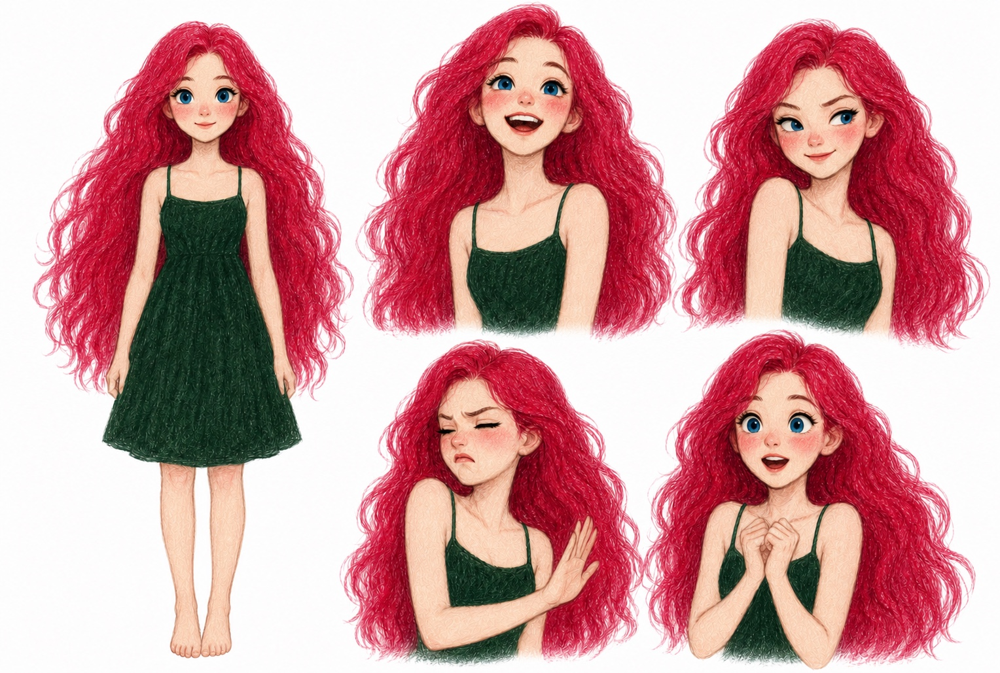

# Yanqi Illustrations

一个面向 AI Agent 的中文正文配图 Skill。它沿用 Ian Xiaohei Illustrations 的工作流框架，并将人物身份、画风、提示词、构图与质检规则完整替换为焱七 IP。



## 定稿人物

- 鲜亮莓粉色、浓密蓬松的及腰长卷发
- 清澈明亮的蓝色大眼睛，白皙象牙肤色与自然红晕
- 固定森林绿细肩带 A 字裙，裙摆位于膝盖上方
- 年轻成年女性的纤细修长比例，长腿，不做 Q 版
- 纯白背景，细腻柔和的数字插画质感

基准图只用于锁定人物身份。实际正文配图不会复制五宫格角色设定页，而是让焱七进入具体场景并完成核心动作。

## 使用方式

将 `yanqi-illustrations/` 安装到 Agent 的 Skills 目录，然后直接描述正文内容或配图目标，例如：

> 用焱七 IP 给这段文章画一张 16:9 正文配图，表达“把零散灵感整理成可执行计划”。

Skill 会依次完成：提取核心概念、选择构图、锁定人物基因、生成图片和按清单质检。

## 目录

```text
yanqi-illustrations/
├── SKILL.md
├── agents/openai.yaml
├── assets/yanqi-ip-master.jpg
└── references/
    ├── yanqi-ip.md
    ├── style-dna.md
    ├── composition-patterns.md
    ├── prompt-template.md
    └── qa-checklist.md
```

示例调用见 `examples/prompts.md`。原项目的小黑示例图已移到 `examples/upstream-xiaohei-*`，仅用于保留上游归属，不参与焱七生成流程。

## 上游项目

本项目改编自 [Ian Xiaohei Illustrations](https://github.com/helloianneo/ian-xiaohei-illustrations)，工作流设计与原始示例归 Ian 所有。详细说明见 `NOTICE.md`。
